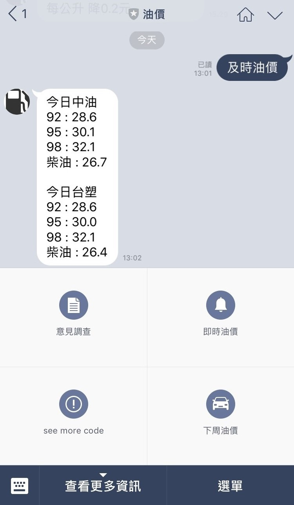
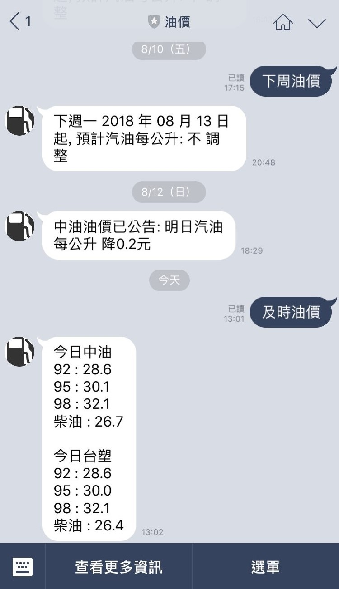

# 油價 x Line Chat Bot x Node.js x Heroku
 
透過圖文選單可以點選
*   即時油價
*   下周油價
*   意見調查
*   see more code
 

執行結果 

## 關於油價 Bot
使用Node.js架設於Heroku進行開發，搭配Uptime Robot觸發Heroku 

透過使用者加入好友事件(follow) 

存取Line的Token至資料庫mLab(MongoDB) 

使用cheerio css select 抓取資訊 

## 特色
每周五及日晚上六點 **自動推送下周油價** 給使用者 

使用者點選圖文選單中的即時或下周油價時 

一樣可以達到相同效果 

### 使用版本
*   Node.js : 6.11.2  
*   cheerio : 1.0.0-rc.2  
*   express : 4.16.3  
*   linebot : 1.4.1  
*   moment : 2.22.2  
*   mongoose : 5.2.0  
*   request : 2.87.0  
